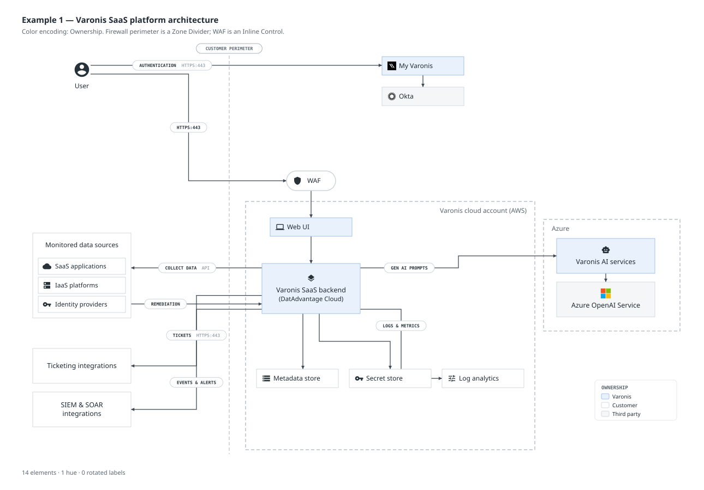
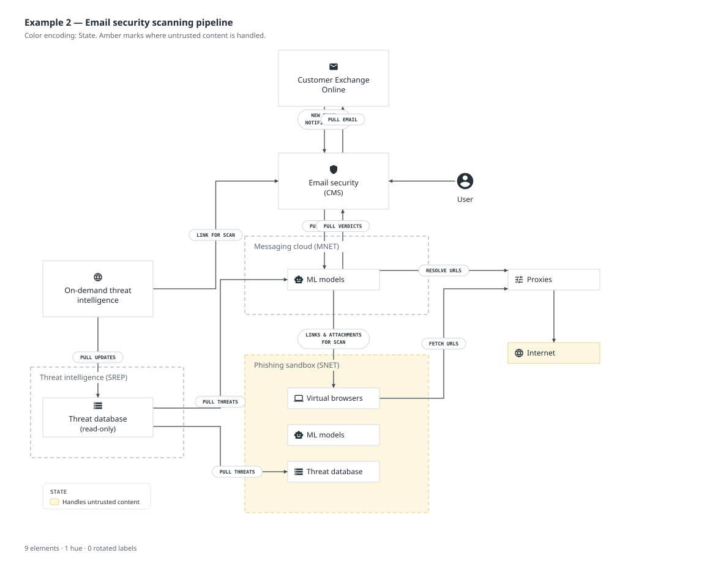
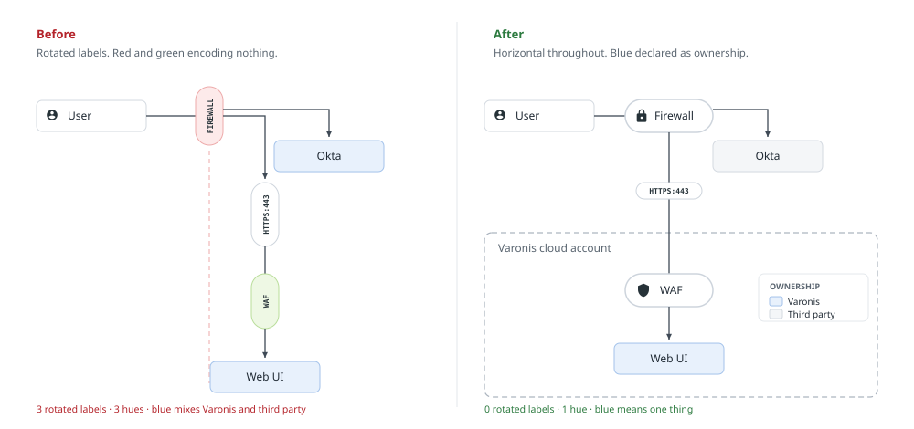

# Varonis Diagram Style Guide

**Version 2.3 — August 2026**
Supersedes the Diagram Toolkit (July 2026). Covers architecture, flow, and system diagrams only. Charts, graphs, and infographics are a separate system with separate rules — do not apply this guide to data visualization.

This file is the source of truth for both people and tooling. Humans read sections 1–10. Build tooling reads section 11.

---

## 1. Principles

**Diagrams are technical claims, not illustrations.** A Varonis architecture diagram is read by security architects who will use it to decide whether to trust us. Accuracy and legibility beat visual interest every time.

**Grayscale is the default.** A diagram with no color is always acceptable. Color is added when it answers a question the reader is already asking — never to add interest.

**One idea per diagram.** If you need a legend with more than five entries, or the element count is over ~18, you have two diagrams.

**Composition over creation.** Build from the elements defined here. If you need something that doesn't exist, request it from the Brand Team rather than inventing it locally — a one-off shape in one deck becomes a competing standard within a quarter.

---

## 2. About this version

Version 2.3 is the current guide. It supersedes the v1 Diagram Toolkit (PDF), which introduced the element kit but left color, icons, and vendor marks to convention. If you're new to Varonis diagrams, skip to §3 — the taxonomy, color model, and worked examples in §3–§10 are all you need. The v1 → v2 changelog and migration notes live in [Appendix A](#appendix-a--what-changed-in-v20) for anyone maintaining older material.

---

### 3.0 Shape is semantic

Corner treatment is not decoration — it tells the reader what kind of thing they are looking at, and it is the fastest signal in the diagram.

| Shape | Means | Used by |
|---|---|---|
| Square corners | A system: something that exists and holds state | Element, Grouped Element, Boundary |
| Fully rounded (stadium) | Traffic passes through this, or this annotates a line | Inline Control, Connector Label |

Never soften an element's corners and never square off a pill. A 6px radius on a box and an 18px radius on a stadium is a weak distinction that readers miss; square against stadium is unmistakable at thumbnail size. Square corners also carry the technical, engineered register these diagrams are meant to have.

Six element types (§3.1–§3.6) plus two text overlays (§3.7). Each has one job. The most common failure in v1 was using one type to do another's job.

### 3.1 Element
A system, service, data store, or application. **The default building block.**

- **Square corners**, 1px stroke
- Three sizes: Small `150×34`, Medium `180×64`, Large `180×92`
- Label in sentence case, 12.5px. Optional second line at 11.5px
- Optional icon or vendor mark (see §7, §8): inline-left on Small; centred horizontally above the label on Medium and Large
- **Height is fixed** by size choice. **Width is a floor** — a small element is at least 150px wide, but its box grows horizontally to fit a label the default width can't hold. Do not shrink type or crush padding to make text fit. Pick the size whose height suits the number of lines (see §9 for the icon-plus-two-lines case), and let the width follow the label
- Labels wrap to a maximum of three lines

### 3.2 Grouped Element
A parent system containing a list of named children — modules, data sources, sub-services.

- Same shell as an Element, square corners. Default 180px wide — matches the Medium/Large element so a Grouped stacked above or below an Element aligns cleanly. Expands horizontally when a row label needs more room (same rule as §3.1)
- Header label centered; child rows are white, 30px tall, 5px gutter
- Maximum six children. Beyond that, summarize ("+12 more") or split the diagram

### 3.3 Inline Control *(new in v2.0)*
**A component that traffic passes through.** Firewall, WAF, proxy, load balancer, gateway, API gateway, CASB.

- Stadium shape (fully rounded), height 36px, 1.5px stroke, white fill
- Width: 90px floor, expands horizontally to fit the label (same rule as §3.1)
- Label in sentence case, 12px, horizontal. Optional 16px icon, left
- Sits **on** the connector path, with the line entering and exiting it
- Grayscale by default. Color only under a declared State encoding (section 6)

The distinction from a connector label is deliberate and load-bearing: a connector label *describes* traffic, an Inline Control *acts on* it. Shape carries that difference — stadium at 36px with sentence-case type is a component, a small 18px pill with mono caps is an annotation.

### 3.4 Boundary
A trust zone, network, cloud account, tenant, or ownership perimeter.

- Dashed rectangle, square corners, 1.2px stroke `#a9b2bd`, dash `6 4`
- **Fill is derived from nesting depth, never chosen.** A top-level boundary has no fill. A boundary nested inside another is filled `#f8f9fa` so it separates from its parent. There is no "dashed boundary" versus "filled region" decision to make — there is one Boundary, and depth determines its fill
- **Maximum two levels of nesting.** Three deep is unreadable; flatten it or split the diagram
- A tinted zone (§6.3.7) overrides the derived fill, since the tint is carrying a claim
- Label top-left, inset 15px, 12px, `#5a6570`, sentence case
- **Never colored.** A red boundary makes everything inside it read as dangerous
- Minimum 20px padding between the boundary edge and any element inside it
- Label sits top-left by default. **Move it to the top-right when a connector crosses the top edge near it** — a label with an arrow through it is the second most common defect after rotated text. Where neither side is clear, give the label an opaque backing in the boundary's own fill so connectors pass cleanly behind it

### 3.5 Zone Divider *(new in v2.0)*
A linear demarcation that runs across the diagram — the classic "everything left of this line is on-prem" cut.

- Single dashed line, 1px, `#a9b2bd`, dash `6 4`, full height or width of the affected region
- Horizontal label chip at the top or left end. **Never rotated**
- Grayscale only
- Use a Boundary instead whenever the zone can be enclosed. A divider is for cuts that genuinely have no enclosing rectangle

### 3.6 Actor
A human role: user, administrator, analyst, attacker.

- 32px person or group icon, centered, no containing box
- Label beneath, sentence case, 12px
- Actors sit outside boundaries unless the diagram is specifically about an insider

### 3.7 Text overlays
Two placeable text items sit outside the shape kit. They carry no border, no fill, and no icon — text and nothing else.

- **Title.** The diagram's heading. Bold, 18px, ink `#1f2933`. One per diagram. Placed anywhere on the canvas (typically top-left). Use it instead of setting title text through slide chrome
- **Caption.** Secondary explanatory text. Regular, 11px, `#5a6570`. A caption declares the color encoding (§6.2), calls out a legend, or notes an assumption. Not for arbitrary annotations — those belong on the elements or connectors they describe

### 3.8 Legend
Not an element in the usual sense: a small keyed swatch table required when more than six elements are colored, or whenever State encoding is used (§6.3.9).

- Auto-sized rectangle, 1px stroke `#d3d9e0`, white fill
- Header names the encoding (`OWNERSHIP`, `EMPHASIS`, `STATE`) in uppercase 9px, `#5a6570`
- One row per swatch: 14×10px chip in the palette color, followed by the reader-facing label at 10px `#1f2933`
- Placed in a corner where it does not compete with the flow. One legend per diagram

---

## 4. Connectors

- **Primary:** solid, 1.3px, `#3f4a56`, filled arrowhead at the destination
- **Special use case:** dashed, 1.3px, `#9aa4b0`, dash `5 4`. Reserved for indirect, asynchronous, optional, or out-of-band relationships. Do not use dashed lines for "less important"
- **Routing:** straight where possible; three-segment orthogonal elbow otherwise. No diagonals through elements, no curves
- **Termination:** a connector meets the **midpoint** of the edge it lands on and stops at the element boundary. Where several connectors share one edge, space them evenly and centre the group on the midpoint. A straight connector may align to its target's midpoint instead when that avoids an unnecessary elbow. An arrow arriving near a corner reads as a miss, and is the most common polish defect in a finished diagram
- **Alignment:** elements joined by a straight connector share a centre line. If two boxes are nearly aligned, align them exactly — a 6px offset reads as a mistake where a 60px offset reads as intent
- **Direction:** every connector is directional. If a relationship is genuinely bidirectional, draw two connectors, not a double-headed arrow
- **Crossings:** minimize by reordering elements. If unavoidable, cross at 90°
- **Color:** connectors are never colored except under a declared State encoding

---

## 5. Connector labels and text

### 5.1 Connector label
Annotates what travels along a line: a protocol, port, action, or payload.

- Pill, 18px tall, radius 9, white fill, 1px `#cdd4dc` stroke
- Label in **UPPERCASE MONOSPACE**, 8px, bold
- Optional secondary text in the same size, regular weight, `#7a8794` — for ports, versions, or qualifiers (`AUTHENTICATION  HTTPS:443`)
- Optional leading number badge, 7.5px circle, for stepped sequences. Number badges imply order — only use them when order matters
- Centered on the connector, with the line passing behind it
- Text is optically centred in the pill. Where optional text follows the label, the label-plus-optional pair is centred as a single block
- Maximum 30 characters. Wrap to two lines at 32px tall before exceeding that

### 5.2 The horizontal rule
**No text in a Varonis diagram is ever rotated.** Not connector labels, not boundary labels, not zone dividers, not element labels.

When a label sits on a vertical run and doesn't fit:

1. Wrap it to two lines
2. Shorten it — `HTTPS:443` is better than `CONNECTS VIA HTTPS ON PORT 443`
3. Move the label to the horizontal segment of an elbow
4. If it's a component rather than an annotation, it's an Inline Control — use that instead

### 5.3 Casing
- Element and Inline Control labels: sentence case
- Connector labels: uppercase monospace
- Boundary labels: sentence case
- No trailing periods anywhere
- Product names follow the corporate naming standard exactly — never abbreviate Varonis product names in a diagram

### 5.4 Labels must fit their element
Text never touches or crosses an element edge. Keep a minimum 15px of clear space on each side.

Where a label doesn't fit, the fix is a bigger element or a shorter label — never a smaller type size, and never letting the text run to the edge. Small elements hold roughly 105px of label beside an icon; Medium and Large hold roughly 150px and wrap to a maximum of three lines. Tooling should measure and fail the build rather than trusting a character count.

---

## 6. Color

This is the section that gets violated most. Read it twice.

### 6.1 Color is a claim

Every colored element asserts that it differs from the grayscale elements in some specific way. If a reader can't state what that way is within two seconds, the color is noise and is actively costing you credibility.

### 6.2 Declare one encoding per diagram

Before adding any color, ask **what question the reader brings to this diagram**, then pick the one encoding that answers it. Write it in the caption or legend. Never mix two in one diagram.

The question comes first and the element count second. A diagram about responsibility wants Ownership; a diagram about a feature wants Emphasis; a diagram about containment or compromise wants State.

**Ownership** — who operates the component.
- Varonis-operated: blue
- Customer-operated: white
- Third-party: gray
- Use when the diagram's job is to clarify responsibility boundaries.

**Emphasis** — what this diagram is about.
- The 1–3 components under discussion: blue
- Everything else: white or gray
- Use for feature and product diagrams. This is the most common encoding.

**State** — condition, before and after.
- At risk / exposed / attacker-controlled: red
- Degraded / needs attention / partial: amber
- Protected / remediated / verified: green
- Use **only** for kill-chain, attack-path, and before/after diagrams where state is the entire point.

### 6.3 Hard rules

1. **Blue is the only structural accent.** Under Ownership and Emphasis encodings, blue is the sole color used. No exceptions.
2. **Cap blue at one third of elements under Emphasis.** Past that it stops reading as emphasis and becomes the new baseline. Under Ownership the cap is a smell rather than a limit: if nearly every element shares one owner, Ownership is simply answering a question nobody asked, so change encoding — do not decolor a true diagram to satisfy an arithmetic rule.
3. **Red, amber, and green encode state, never type.** A firewall is not red because security is dangerous. A WAF is not green because protection is good. Both are grayscale Inline Controls.
4. **Maximum two hues per diagram**, excluding grayscale. A third hue means the diagram is doing too much — split it.
5. **Never encode meaning in color alone.** Every colored element must carry the same meaning in its label, icon, or position. Test: desaturate the diagram. If it still reads, it passes. If it doesn't, fix it before shipping.
6. **Red and green never carry the sole distinction between two elements.** Roughly 8% of men have a red-green color vision deficiency, and a meaningful share of our audience is in that group.
7. **Boundaries and zone dividers are never colored — with one exception.** Under a State encoding, where the claim is about the zone itself rather than its contents, a boundary may carry a single tint. A detonation zone, an untrusted network, or a compromised segment is a legitimate case. When a zone is tinted, **nothing inside it is colored**: the zone is making the claim, and coloring its contents doubles the same statement.
8. **Connectors are grayscale** except under a State encoding, where a red path may trace an attack route.
9. **Legend required** when more than six elements are colored, or whenever State encoding is used.
10. **Yellow is amber.** It exists only as a State color. It is not an element fill.

### 6.4 Palette

| Token | Fill | Stroke | Permitted use |
|---|---|---|---|
| `white` | `#ffffff` | `#d3d9e0` | Default element |
| `gray` | `#f4f6f8` | `#d3d9e0` | Default, de-emphasized, or third-party |
| `blue` | `#e8f1fc` | `#a3c2ea` | Ownership: Varonis. Emphasis: focal element |
| `red` | `#fdeaea` | `#eda9a9` | State only: at risk, exposed, attacker-controlled |
| `amber` | `#fdf6e0` | `#e8d38a` | State only: degraded, warning, partial |
| `green` | `#eef8e4` | `#b9dd9a` | State only: protected, remediated, verified |

Text is `#1f2933` on all fills. Secondary text is `#5a6570`. Connectors are `#3f4a56` primary, `#9aa4b0` dashed.

### 6.5 Worked example

The v1 example diagram used a red `FIREWALL`, a green `WAF`, and blue for both `My Varonis` (Varonis) and `Okta` (third party). Three separate failures: red and green encoded type rather than state, blue mixed Ownership and Emphasis in one diagram, and the color pair was the least accessible one available.

Corrected: firewall and WAF become grayscale Inline Controls. Blue is declared as Ownership and applied to Varonis surfaces only. Okta becomes gray as a third party. The diagram loses two colors and gains a readable claim.

---

## 7. Icons

### 7.1 Icons are the exception, not the default

**Start every element with no icon.** A label already says what the thing is; an icon that repeats the label adds visual weight and no information. The best technical diagrams in the industry are mostly label-only boxes, with icons reserved for the few places an icon says something the words can't.

**Add an icon when:**
- The diagram mixes several *kinds* of thing — a data store next to a service next to a browser next to a person — and the icon lets a reader sort them at a glance
- The element belongs to a well-known category with an unambiguous mark: database, queue, model, browser, key store, mail
- The icon is doing the identifying work and the label is the specific name (`Metadata store`, `Threat database`)

**Leave the icon off when:**
- Every element in view is the same kind of thing — then icons distinguish nothing and become texture
- The label already states the category plainly (`Ticketing integrations`, `SIEM & SOAR integrations`)
- The only candidate is a generic mark — a gear for "service", a box for "system". A generic icon is decoration
- The element is a Grouped Element header whose children carry their own icons

### 7.2 Consistency within a peer group

**Within a peer group, icons are all or nothing.** Sibling elements inside the same boundary, or a row of elements serving the same role, either all carry icons or none do. A mixed row reads as an oversight rather than a decision. Different peer groups in the same diagram may make different choices.

**What counts as a peer group.** The rule applies to elements sharing a boundary or the rows of a grouped element — cases where the reader will read the members as one set. It does not apply to unrelated elements that merely sit outside every boundary; those are not peers of each other and can each make their own icon choice. Automated style checks enforce this at the boundary/grouped-element scope only, for the same reason.

### 7.3 Specification

- **Source:** Google Material Symbols only. Settings: Weight 200, Grade 200, Optical size 24
- **Size:** 24px (0.33in) standard. Up to 0.4in (29px) only to compensate for excessive internal padding, applied consistently across the whole diagram
- **Placement:** on Small elements the icon sits inline to the left of the label. On Medium and Large elements it is **centred horizontally above** the label, and the icon-plus-label block is centred vertically in the box as a unit. Never park the icon in a corner while the label is centred — the two read as unrelated
- **Alignment:** icons sitting beside text align to the **cap height** of that text, not the line box. This is the single most common source of "something looks off" in a finished diagram
- **Render size:** 24px is the source and PowerPoint size. In SVG the icon renders at 16px so it sits correctly inside a 34px Small element; keep it identical across every element in a diagram
- **Weight pairing:** icon stroke weight tracks the label weight. Regular labels take Weight 200; bold or emphasized labels take Weight 300
- **Color:** icons are `#263238` and inherit no fill color from their element
- **One icon per element.** Icons clarify type; they are not decoration

---

## 8. Vendor marks

### 8.1 When a mark is warranted

A vendor logo is a claim that **this specific vendor** matters to the diagram. Use one only when the claim is true.

**Use a mark when:**
- The vendor's identity is load-bearing — the diagram is about running in *AWS*, landing data in *Snowflake*, federating with *Okta*. Swap the vendor and the diagram means something different
- The element represents a specific named platform, account, or tenant the reader will recognize

**Do not use a mark when:**
- The element is a category rather than a product. `SaaS applications`, `IaaS platforms`, and `Identity providers` take an icon, not a logo. A vendor mark on a generic category implies an exclusivity or a depth of integration you may not mean
- The vendor is one example among many. If the honest label is "for example, Databricks", the element should say `Data warehouse` and the vendor belongs in the narration
- The mark is there to signal breadth. A grid of vendor tiles is a marketing claim about coverage, not an architecture statement. It belongs on a web page, not in a system diagram

**Peer-group consistency applies exactly as it does for icons (§7.2):** within a boundary or the rows of a grouped element, either all carry marks or none do. See §7.2 for the scope of "peer group."

### 8.2 Placement and sizing

- Official SVG brand marks only. The same slot as an icon: inline-left on Small elements, centred above the label on Medium and Large
- **Rendered size:** 16px on Small, 20px on Medium and Large. The 24px figure in §7.3 is the source glyph size; on-canvas it renders proportionate to the element so it never overwhelms the label
- A mark **replaces** the icon. Never both
- Never recolor, rotate, outline, crop, or add effects
- **Marks may sit on any fill the encoding permits.** A Varonis mark on a blue Ownership element (see §10, Example 1) reinforces the ownership claim rather than contradicting it; under State encoding a mark on a colored element is likewise consistent with the fill's meaning. The earlier "white or gray only" rule is retired

**Badge form.** As an alternative to inline placement, a mark may take over an element as a square badge — the mark centred, the text label suppressed. Use it for a Grouped Element header or a standalone vendor tile where the mark is the whole point. Badge sizes track the element choice (Small 64, Medium 90, Large 120). The suppressed label still lives in the model for accessibility.

### 8.3 Platform badges on boundaries

Where a boundary represents a specific cloud account, tenant, or platform, the mark sits in the **top-right corner of the boundary**, opposite the label, at 24px. This identifies the environment without claiming that anything inside it belongs to that vendor — which is why an AWS badge on the boundary and a blue Varonis service inside it do not contradict each other.

### 8.4 The Varonis mark

Under Ownership encoding the blue fill already identifies Varonis-operated surfaces, so a Varonis logo on every one is usually redundant. Use it deliberately: on the specific surfaces you want a reader to recognise on sight (a hosted platform, a named service, a landing page). More than one Varonis mark in a diagram is allowed — the earlier "at most once per diagram" cap is retired.

### 8.5 Sourcing and rights

Marks come from each vendor's official brand page. Do not trace, redraw, screenshot, or pull a logo from a search result — wrong versions and outdated marks are the most common way a diagram ends up looking unofficial. Requests for marks not in the library go to the Brand Team.

Vendor marks carry trademark obligations, and using one can imply a partnership or endorsement that does not exist. Anything customer-facing that shows a vendor mark in a partnership, certification, or co-selling context goes past Legal before it ships. This guide governs how a mark is drawn, not whether you have the right to use it.

---

## 9. Layout, spacing, and export

**Padding** is inherited unchanged from the v1 toolkit and is mandatory, not advisory.

| Where | Value |
|---|---|
| Element, left and right of label | 15px |
| Element with icon: left edge to icon | 10px |
| Element with icon: icon to label | 5px |
| Element with icon: label to right edge | 15px |
| Grouped element, left and right | 10px |
| Grouped element, top to header | 15px |
| Grouped element, header to first row | 15px |
| Grouped element, between rows | 5px |
| Grouped element, last row to bottom | 10px |
| Boundary edge to any element inside | 20px |

PowerPoint conversion: 15px = 0.21in, 10px = 0.14in, 5px = 0.07in.

A consequence worth stating: a Medium element cannot hold an icon plus a two-line label and still keep its padding. **Icon plus two lines requires a Large element.** Tooling should fail the build rather than quietly crushing the padding.

**Grid:** all elements snap to a 10px grid. Alignment is not eyeballed.

**Spacing:** minimum 60px between connected elements so labels have room. Minimum 40px between stacked elements that are *not* connected to each other — tighter than that and unrelated elements read as a group. Minimum 20px between a boundary edge and its contents.

**Sizing:** use the smallest size that fits the label with its padding. An oversized element implies importance it may not have, and a column of elements at different sizes for no reason reads as noise.

**Flow direction:** left-to-right for process and data flow; top-to-bottom for hierarchy and control planes. Pick one per diagram and hold it.

**Density:** hard cap of 18 elements. At that point either split by audience or abstract a cluster into one Grouped Element.

**Export:** PNG for slides and web at 2x with transparent background. SVG for anything that will be edited, translated, or re-rendered. Never export JPG.

**Accessibility floor:** every diagram ships with alt text stating the flow in one or two sentences. Text contrast meets WCAG AA at final display size. The diagram must survive desaturation (rule 6.3.5).

---

## 10. Worked examples

Both examples from the v1 toolkit, redrawn to v2.0. They are the reference for what finished work looks like.

### Example 1 — Varonis SaaS platform architecture



Demonstrates **Ownership** encoding and both new element types.

- The firewall perimeter spans the whole diagram and multiple flows cross it, so it is a **Zone Divider** with a horizontal label chip — not a rotated pill.
- The WAF sits on one specific path with traffic entering and leaving it, so it is an **Inline Control**, grayscale.
- Blue means Varonis-operated, and only that. Okta moves to gray as a third party, which it was not in v1.
- Azure is a **Boundary**, not a colored box. That resolves the awkward case of a Varonis-operated service running inside a third-party platform: the boundary is uncolored, so the element inside it can be blue without contradiction.
- 14 elements, one hue, four of fourteen elements blue (29%, inside the one-third cap).

### Example 2 — Email security scanning pipeline



Demonstrates **State** encoding and the tinted-zone exception.

Ownership was the wrong instinct here — nearly every component is Varonis-operated, so coloring by owner would have turned most of the diagram blue and told the reader nothing. Emphasis was wrong too: no single component is the subject.

The question a security architect actually brings to this diagram is *where does untrusted content go, and what stops it escaping.* That is a State question, so amber marks the phishing sandbox zone and the internet — the two places untrusted content lives. Everything inside the tinted zone stays white, because the zone is already making the claim. One hue, one question answered, and the containment argument is legible in about a second.

This diagram had nine rotated labels in v1 and has none now.

**The general rule this establishes:** choose the encoding that answers the reader's question. Element-count caps are a check on that choice, not a substitute for making it.

---

## Appendix A — What changed in v2.0

For readers coming from the v1 Diagram Toolkit (PDF, July 2026). Newcomers can skip this section entirely — the current guide (§1–§10) is complete on its own.



| # | Change | Why |
|---|--------|-----|
| 1 | **Rotated text is banned.** All type is horizontal. | Vertical labels are slow to read, break on mobile, and are inaccessible to screen readers and alt text. |
| 2 | **Inline Control introduced** as a distinct element type. | Firewalls, WAFs, proxies, and gateways were being drawn as connector labels. They are components, not annotations. |
| 3 | **Zone Divider introduced** for linear trust boundaries. | Boundaries were being drawn as colored dashed connectors, which reads as data flow. |
| 4 | **Color rules rewritten** (section 6) around a single declared encoding. | Red and green were being used decoratively, encoding nothing and failing color-blind readers. |
| 5 | **Boundaries and containers are never colored.** | Color belongs to elements. Zones tint the whole reading. |
| 6 | **Icons align to cap height**, stroke weight paired to type weight. | Icons were floating optically high next to labels. |
| 7 | **Square corners confirmed** for elements and boundaries; rounding reserved for pills and Inline Controls. | Shape now carries meaning. v1 was already square; a rounded interim draft was reverted. |
| 8 | **v1 padding restated as mandatory**, with the consequence that icon plus two lines needs a Large element. | Padding was being silently crushed to fit long labels. |
| 9 | **Connectors terminate on edge centre lines.** | Arrows landing near corners read as misses. |
| 10 | **Boundary labels sit above connectors** and may move to the top-right. | Connectors were cutting through zone labels. |
| 11 | **Icons are now opt-in, with peer-group consistency required** (section 7.1–7.2). | Icons were being applied by default, adding weight without information. |
| 12 | **Connectors spaced evenly and centred on shared edges**; aligned elements share a centre line. | Arrows were landing near corners and boxes sat a few pixels out of true. |
| 13 | **40px minimum between unconnected stacked elements**; use the smallest size that fits. | Unrelated elements were reading as groups, and oversized boxes implied false importance. |
| 14 | **Boundary fill derived from nesting depth**, not offered as a choice. Max two levels of nesting. | "Dashed boundary" and "filled region" behaved identically because the rule was never mechanical — and the reference examples applied it inconsistently. |
| 15 | **Section 8 rewritten** around when a vendor mark is warranted, plus platform badges on boundaries. | The old section covered how to place a mark but never when to use one. |

**Migration:** existing diagrams don't need retroactive rework. Apply v2.0 the next time a diagram is edited. The two changes worth backporting immediately are un-rotating text and removing decorative red/green.

---

## 11. Tokens

Machine-readable spec for build tooling. These values are authoritative; the prose above describes them, it does not override them.

```json
{
  "version": "2.3.0",
  "canvas": { "grid": 10, "minElementGap": 60, "minUnconnectedGap": 40, "boundaryPadding": 20, "maxElements": 18 },
  "palette": {
    "white":  { "fill": "#ffffff", "stroke": "#d3d9e0", "role": "default" },
    "gray":   { "fill": "#f4f6f8", "stroke": "#d3d9e0", "role": "default" },
    "blue":   { "fill": "#e8f1fc", "stroke": "#a3c2ea", "role": "accent" },
    "red":    { "fill": "#fdeaea", "stroke": "#eda9a9", "role": "state" },
    "amber":  { "fill": "#fdf6e0", "stroke": "#e8d38a", "role": "state" },
    "green":  { "fill": "#eef8e4", "stroke": "#b9dd9a", "role": "state" }
  },
  "ink": {
    "primary": "#1f2933", "secondary": "#5a6570", "icon": "#263238",
    "connector": "#3f4a56", "connectorDashed": "#9aa4b0",
    "labelStroke": "#cdd4dc", "boundaryStroke": "#a9b2bd", "optionalText": "#7a8794"
  },
  "elements": {
    "element":       { "radius": 0, "stroke": 1, "sizes": { "sm": [150,34], "md": [180,64], "lg": [180,92] },
                       "padding": { "side": 15, "iconLeft": 10, "iconToLabel": 5 },
                       "iconPlacement": { "sm": "inline-left", "md": "centred-above", "lg": "centred-above" },
                       "iconDefault": "none", "iconPeerGroupConsistency": true,
                       "iconPlusTwoLinesRequires": "lg" },
    "grouped":       { "radius": 0, "stroke": 1, "width": 180, "maxChildren": 6,
                       "padding": { "side": 10, "top": 15, "headerToRow": 15, "rowGap": 5, "bottom": 10 },
                       "rowHeight": 30 },
    "inlineControl": { "shape": "stadium", "minWidth": 90, "height": 36, "stroke": 1.5, "fill": "#ffffff", "iconSize": 16 },
    "boundary":      { "radius": 0, "stroke": 1.2, "dash": "6 4", "strokeColor": "#a9b2bd",
                       "fillByDepth": { "0": "none", "1+": "#f8f9fa" }, "maxNestingDepth": 2,
                       "innerPadding": 20, "labelSide": ["left","right"], "labelAboveConnectors": true,
                       "colorable": "stateEncodingZoneClaimOnly" },
    "zoneDivider":   { "stroke": 1, "dash": "6 4", "strokeColor": "#a9b2bd", "colorable": false, "labelPosition": "start" },
    "actor":         { "iconSize": 32, "box": false, "labelBelow": true }
  },
  "connectors": {
    "primary": { "stroke": 1.3, "color": "#3f4a56", "arrow": true },
    "dashed":  { "stroke": 1.3, "color": "#9aa4b0", "dash": "5 4", "arrow": true },
    "routing": ["straight", "orthogonal-elbow"],
    "termination": "edge-midpoint",
    "sharedEdgeConnectors": "evenly-spaced-centred-on-midpoint",
    "colorable": "stateEncodingOnly"
  },
  "connectorLabel": {
    "height": 18, "heightTwoLine": 32, "radius": 9,
    "font": { "family": "monospace", "size": 8, "weight": 700, "transform": "uppercase" },
    "optionalText": { "weight": 400, "color": "#7a8794" },
    "numberBadge": { "radius": 7.5, "implies": "sequence" },
    "maxChars": 30
  },
  "typography": {
    "elementLabel":   { "size": 12.5, "case": "sentence", "maxLines": 3 },
    "elementSubLabel":{ "size": 11.5, "case": "sentence" },
    "smallLabel":     { "size": 12,   "case": "sentence" },
    "boundaryLabel":  { "size": 12,   "case": "sentence", "color": "#5a6570", "inset": 15 },
    "rotation": "forbidden"
  },
  "icons": {
    "library": "material-symbols",
    "renderSizeSvg": 16,
    "settings": { "weight": 200, "grade": 200, "opticalSize": 24 },
    "size": 24, "maxSize": 29, "align": "cap-height", "color": "#263238", "perElement": 1
  },
  "colorRules": {
    "encodings": ["ownership", "emphasis", "state"],
    "encodingsPerDiagram": 1,
    "maxHues": 2,
    "blueMaxShareOfElements": 0.33,
    "blueCapAppliesTo": "emphasis",
    "zoneTintAllowedUnder": "state",
    "tintedZoneContentsUncoloured": true,
    "stateColorsEncodeType": false,
    "colorAloneCarriesMeaning": false,
    "legendRequiredAbove": 6,
    "legendRequiredForState": true
  },
  "vendorMarks": {
    "size": 24, "replacesIcon": true, "allowedFills": "any",
    "boundaryBadgePosition": "top-right", "peerGroupConsistency": true
  },
  "export": { "png": { "scale": 2, "background": "transparent" }, "svg": true, "jpg": false }
}
```

---

*Questions, new element requests, and third-party logo sourcing: contact the Brand Team.*
